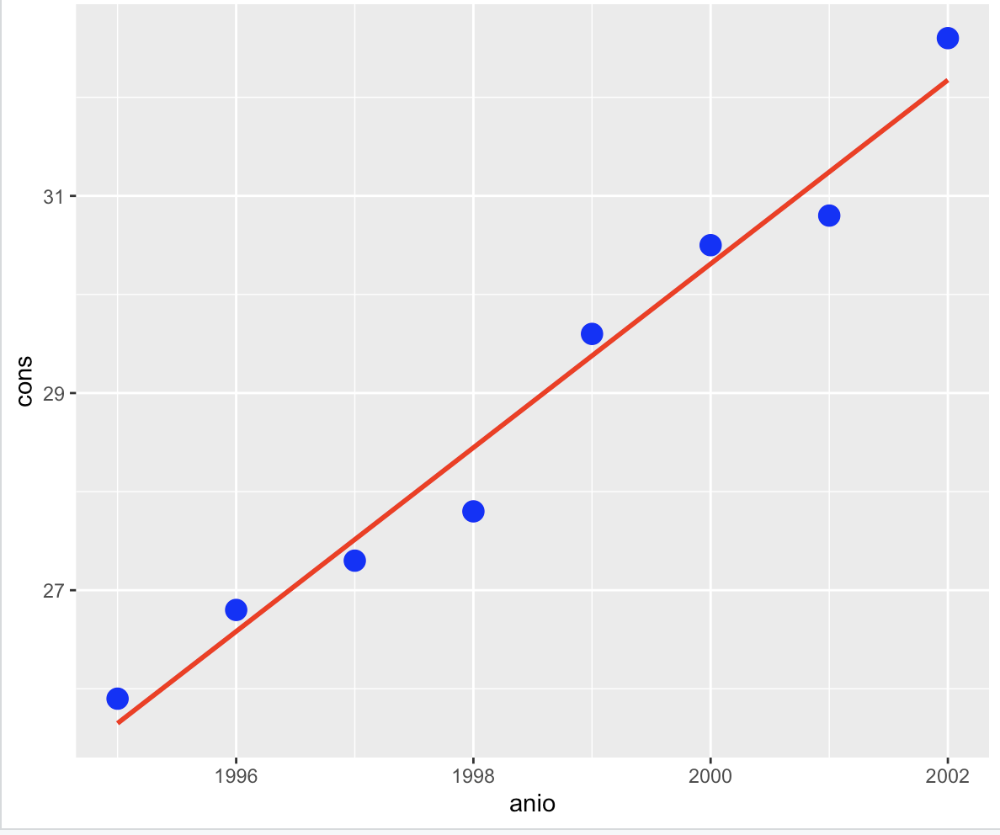
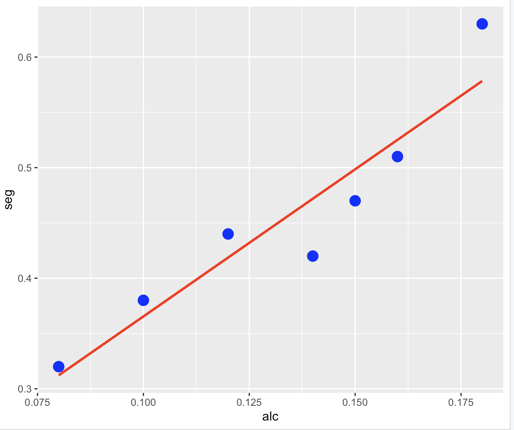
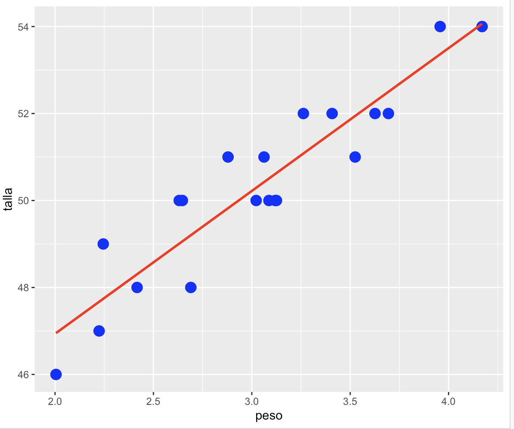

# R-linear-regression
This is a work from stadistics

##### A continuación se muestran los consumos anuales de productos derivados del pollo (en millones de libras) en Estados Unidos, entre los años 1995 y 2002:

 25.9 26.8 27.3 27.8 29.6 30.5 30.8 32.6 

 
<ul>
  <li>Ecuación de regresión lineal estimada.</li>
    
      Por cada año los consumos anuales de productos derivados del pollo en Estados Unidos
      aumentan 0.93 millones de libras.
  <li>Diagrama de dispersión con la ecuación de regresión obtenida</li>
    
  <li>Coeficiente de correlación lineal de Pearson.</li>
    
    Este valor es muy cercano al uno por lo que indica una correlación lineal muy alta, e indica una relación lineal positiva
</ul>

##### Se cree que, cuanto mayor es el contenido de alcohol en la sangre de un individuo, más lenta es su capacidad de reacción. Para comprobar esto, a 10 voluntarios se les suministraron distintas cantidades de alcohol. Tras ello, se midieron sus niveles de alcohol en la sangre, en porcentaje por unidad de peso corporal, y se midieron sus tiempos de reacción a un determinado estímulo. Los datos resultantes se muestran a continuación.

<table align="center">
  <tr>
    <th>x = nivel de alcohol en la sangre (%)</th>
    <th>y=tiempo de reacción (segundos)</th>
  </tr>
  <tr>
    <td>0.08</td>
    <td>0.32</td>
  </tr>
  <tr>
    <td>0.10</td>
    <td>0.38</td>
  </tr>
  <tr>
    <td>0.12</td>
    <td>0.44</td>
  </tr>
  <tr>
    <td>0.14</td>
    <td>0.42</td>
  </tr>
  <tr>
    <td>0.15</td>
    <td>0.47</td>
  </tr>
  <tr>
    <td>0.16</td>
    <td>0.51</td>
  </tr>
  <tr>
    <td>0.18</td>
    <td>0.63</td>
  </tr>
</table>

<ul>
  <li> Ecuación de regresión lineal estimada.</li>
  
  <li> Diagrama de dispersión con la la ecuación de regresión obtenida</li>
  
  <li> Coeficiente de correlación lineal de Pearson</li>
  
  Este valor es muy cercano al uno aunque no tanto como la anterior esta también indica una correlación lineal muy alta, e indica una relación lineal positiva.
  

</ul>

##### En la siguiente tabla se presentan los pesos en kilos y las tallas en centímetros de 20 niños recién nacidos. Considere que el peso es la variable independiente y la talla la variable dependiente

<table align="center">
  <tr>
    <th>Peso</th>
    <th>Talla</th>
    <th> </th>
    <th>Peso</th>
    <th>Talla</th>
  </tr>
  <tr>
    <td>3.262</td>
    <td>52</td>
    <td></td>
    <td>2.690</td>
    <td>48</td>
  </tr>
  <tr>
    <td>3.022</td>
    <td>50</td>
    <td></td>
    <td>3.119 </td>
    <td>50</td>
  </tr>
  <tr>
    <td>3.062 </td>
    <td>51</td>
    <td></td>
    <td>3.525</td>
    <td>51</td>
  </tr>
  <tr>
    <td>2.879</td>
    <td>51</td>
    <td></td>
    <td>2.245</td>
    <td>49</td>
  </tr>
  <tr>
    <td>3.626</td>
    <td>52</td>
    <td></td>
    <td>2.417</td>
    <td>48</td>
  </tr>
  <tr>
    <td>3.957</td>
    <td>54</td>
    <td></td>
    <td>2.631</td>
    <td>50</td>
  </tr>
  <tr>
    <td>4.170</td>
    <td>54</td>
    <td></td>
    <td>2.647</td>
    <td>50</td>
  </tr>
  <tr>
    <td>2.224</td>
    <td>47</td>
    <td></td>
    <td>3.087</td>
    <td>50</td>
  </tr>
  <tr>
    <td>3.125</td>
    <td>50</td>
    <td></td>
    <td>2.005</td>
    <td>46</td>
  </tr>
  <tr>
    <td>3.408</td>
    <td>52</td>
    <td></td>
    <td>3.694</td>
    <td>52</td>
  </tr>
</table>

<ul>
<li> Ecuación de regresión lineal estimada.</li>
      
      Por cada peso que aumenten los niños aumenta en 3.28 su talla
<li> Diagrama de dispersión con la ecuación de regresión lineal estimada.</li>
    
<li> Coeficiente de correlación lineal de Pearson.</li>
  
  Este valor es muy cercano al uno aunque no tanto como las anteriores esta también indica una correlación lineal muy alta, e indica una relación lineal positiva.
</ul>

